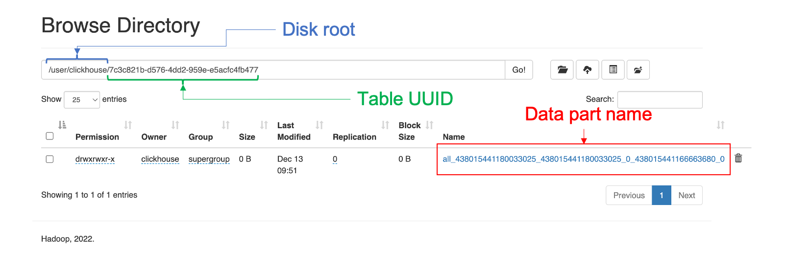

## Prerequisite

Before running, make sure your system has following prerequisite:

- docker
- docker-compose
- a docker runtime is up and running

If you're using MacOS and cannot use docker desktop, you can:

1. Install `docker` and `docker-compose` with `brew install docker docker-compose`
2. Use [Colima](https://github.com/abiosoft/colima) to create a docker runtime env

## Cluster architecture

We are going to deploy a byconity cluster with following architecture:


Four byconity components are:

- server: manage databases and tables, interacting with client, coordinate workers to handle query
- worker-write: handle write (INSERT)
- worker-read: handle read (SELECT)
- daemon-manager: manage the background jobs (merge, kafka, etc...)

There could be more than one worker-write and worker-default, and they can be organized into a **virtual warehouse**. When a virtual warehouse have multiple worker-write, each write query will randomly select a worker to run. When a virtual warehouse have multiple worker-default, a select query will be parallelized among as much workers as possible.

In addition, there're following components in the cluster:

- foudationdb: a transactional kv database, all metadata of databases and tables will be stored here
- hdfs: include one namenode and one datanode, is the *primary* storage of all tables data

## Bring the cluster up

From the current directory, run:

```
docker-compose up
```

Wait until all containers are ready. We can use following commands to check the readiness of byconity components: 

```s
# return 1 indicates that server is working properly
curl '127.0.0.1:21557/?query=SELECT%20count()%20FROM%20system.one'
# return 1 indicates that read worker is working properly and server can connect to it
curl '127.0.0.1:21557/?query=SELECT%20count()%20FROM%20cnch(`vw_default`,system,one)'
# return 1 indicates that write worker is working properly and server can connect to it
curl '127.0.0.1:21557/?query=SELECT%20count()%20FROM%20cnch(`vw_write`,system,one)'
```

Check the tcp protocol by sending a simple query.

```s
# return 10 indicates that tcp server is working properly
docker run -it --network byconity_network -v "`pwd`/byconity/server.yml:/client.yml" canhld/byconity:beta clickhouse-client -C client.yml --host 10.5.0.4 --query "SELECT count() FROM numbers(10)"
```

## Trying some basic queries

Internally, byconity read/write to hdfs with username `clickhouse` (and data is stored in `/user/clickhouse/`), which is not created by default when starting hadoop cluster. We can use following commands to create the user `clickhouse` on hdfs.

```s
docker exec hdfs-namenode-0 hdfs dfs -mkdir /user
docker exec hdfs-namenode-0 hdfs dfs -mkdir /user/clickhouse
docker exec hdfs-namenode-0 hdfs dfs -chown clickhouse /user/clickhouse
docker exec hdfs-namenode-0 hdfs dfs -chmod -R 775 /user/clickhouse 
```

Use following command to open a client terminal to server

```s
docker run -it --network byconity_network -v "`pwd`/byconity/server.yml:/client.yml" canhld/byconity:beta clickhouse-client -C client.yml --host 10.5.0.4
```

We can use following queries to create a database, create a table, insert some data to table, and query from it:

```sql
CREATE DATABASE test;
USE test;
CREATE TABLE events (`id` UInt64, `s` String) ENGINE = CnchMergeTree ORDER BY id;
INSERT INTO events SELECT number, toString(number) FROM numbers(10);
SELECT * FROM events ORDER BY id;
```

If the system is working correctly, the select query should show a similar result as bellow:

```sql
10.5.0.4 :) SELECT * FROM events ORDER BY id;

SELECT *
FROM events
ORDER BY id ASC

Query id: b5c4bc8e-b768-432c-b24c-1aa98c5e512d

┌─id─┬─s─┐
│  0 │ 0 │
│  1 │ 1 │
│  2 │ 2 │
│  3 │ 3 │
│  4 │ 4 │
│  5 │ 5 │
│  6 │ 6 │
│  7 │ 7 │
│  8 │ 8 │
│  9 │ 9 │
└────┴───┘

10 rows in set. Elapsed: 0.015 sec. 
```

## A quick look into how the data is stored

In byconity, the metadata is stored on FoundationDB, while the actual data is store on HDFS. Let's take a look at both of them.

### Metadata

The metadata includes databases, tables, partitions, and parts. Here we only focus on how we store a part in FoundationDB. While you can use `fdbcli` to directly retrieve the data, we provide a system table `system.cnch_parts` to help you quickly query the metadata of a table:

```
┌─name─────────────────┬─type──────────────────────────────────────────────────────────────────────────────┬─flags─┬─default_type─┬─default_expression─┬─comment─┬─codec_expression─┬─ttl_expression─┐
│ database             │ String                                                                            │       │              │                    │         │                  │                │
│ table                │ String                                                                            │       │              │                    │         │                  │                │
│ table_uuid           │ UUID                                                                              │       │              │                    │         │                  │                │
│ partition            │ String                                                                            │       │              │                    │         │                  │                │
│ name                 │ String                                                                            │       │              │                    │         │                  │                │
│ bytes_on_disk        │ UInt64                                                                            │       │              │                    │         │                  │                │
│ rows_count           │ UInt64                                                                            │       │              │                    │         │                  │                │
│ columns              │ String                                                                            │       │              │                    │         │                  │                │
│ marks_count          │ UInt64                                                                            │       │              │                    │         │                  │                │
│ index_granularity    │ Array(UInt64)                                                                     │       │              │                    │         │                  │                │
│ commit_time          │ DateTime                                                                          │       │              │                    │         │                  │                │
│ kv_commit_time       │ DateTime                                                                          │       │              │                    │         │                  │                │
│ columns_commit_time  │ DateTime                                                                          │       │              │                    │         │                  │                │
│ mutation_commit_time │ DateTime                                                                          │       │              │                    │         │                  │                │
│ previous_version     │ UInt64                                                                            │       │              │                    │         │                  │                │
│ partition_id         │ String                                                                            │       │              │                    │         │                  │                │
│ bucket_number        │ Int64                                                                             │       │              │                    │         │                  │                │
│ outdated             │ UInt8                                                                             │       │              │                    │         │                  │                │
│ visible              │ UInt8                                                                             │       │              │                    │         │                  │                │
│ part_type            │ Enum8('VisiblePart' = 1, 'InvisiblePart' = 2, 'DropRange' = 3, 'DroppedPart' = 4) │       │              │                    │         │                  │                │
│ active               │ UInt8                                                                             │       │ ALIAS        │ visible            │         │                  │                │
│ bytes                │ UInt64                                                                            │       │ ALIAS        │ bytes_on_disk      │         │                  │                │
│ rows                 │ UInt64                                                                            │       │ ALIAS        │ rows_count         │         │                  │                │
└──────────────────────┴───────────────────────────────────────────────────────────────────────────────────┴───────┴──────────────┴────────────────────┴─────────┴──────────────────┴────────────────┘
```

Let's try to query all metadata of above example table:

```sql
SELECT
    name,
    rows,
    bytes,
    part_type
FROM system.cnch_parts
WHERE (database = 'test') AND (table = 'events')

Query id: 58c9113e-866f-4a9e-80ee-2d3283b2e4a8

┌─name───────────────────────────────────────────────────────────┬─rows─┬─bytes─┬─part_type───┐
│ all_438015441180033025_438015441180033025_0_438015441166663680 │   10 │  1012 │ VisiblePart │
└────────────────────────────────────────────────────────────────┴──────┴───────┴─────────────┘
```

### Remote data

You can open the hdfs at `localhost:9870` to see how the data is stored. Byconity store each data part as a single file name `data` and the path is `{disk_root}/{table_uuid}/{part_name}/`. In the above example, the data on hdfs is as follow:



Each table will have an UUID, and the path on hdfs is `{disk_root}/{table_uuid}`. Inside the table path, each part is stored in a single file name`data` and the path is `{disk_root}/{table_uuid}/{part_name}/`.


## SSB benchmark